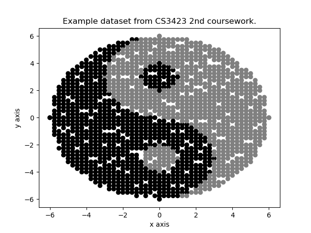
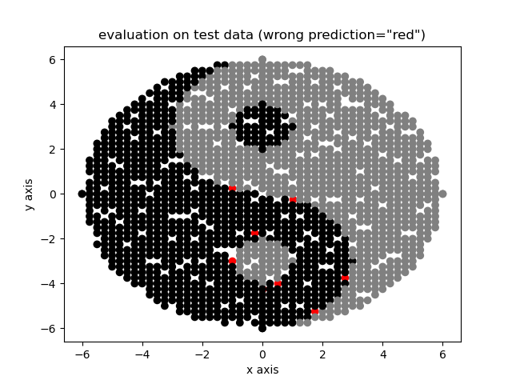

# Detorch: Differentiable Programming Framework 

Pytorch look-like framework written in Python from scratch.  

The main purpose of this project is to understand the internal
structure of differentiable programming frameworks such as pytorch and apply it to the 2nd coursework provided in 
[Biologically_Inspired_Computing (CS3423)](https://github.com/RyotaFuwa/Biologically_Inspired-Computing)  

First, this project is inherited from [NeuralNetworkFramework](https://github.com/RyotaFuwa/NeuralNetworkFramework) attempted
for the first time. Then, restarted with this repository. This project is heavily inspired by 
[Dezero Framwork](https://github.com/oreilly-japan/deep-learning-from-scratch-3/tree/master/dezero) introduced in the book 
called "ゼロから作るDeep Learning ③".

### Classification Problem From CS3423

#### 1. data
training and test data is provided in [./demo/classification_from_CS3423](demo/classification_from_CS3423/data).

#### 2. overview
The problem is a simple classification with 2 dim input (x, y) and 2 class label 'black' or 'white'.
The original objective was to construct a suitable neural net model and find an optimal configuration to get a precise 
prediction on test data.



#### 3. solution using detorch

3.1 Define Simple FNN Model
```python
import detorch.nn as nn 
import detorch.functional as F

class FNN(nn.Module):
  def __init__(self):
    super().__init__()
    self.linear1 = nn.Linear(2, 25)
    self.linear2 = nn.Linear(25, 25)
    self.linear3 = nn.Linear(25, 2)
  
  def forward(self, x):
    x = F.relu(self.linear1(x))
    x = F.relu(self.linear2(x))
    x = F.relu(self.linear3(x))
    return x
```

3.2 Traing the model
```python
# looks very similar to pytorch.
accs = []
for e in range(epochs): 
  for i, x, y in dataloader:
    logits = model(x)
    loss = F.nll_loss(F.softmax(logits), y)
    
    model.zero_grad()
    loss.backward()
    criteria.step()
    
    if i % (dataloader.max_iter * 10) == 0:
      acc = accuracy(logits, y)
      accs.append(acc)
      print("loss: ", loss.data, "acc :", acc)
```

3.3 Evaluate the model
```python
acc = 0
n_samples = 0
for i, x, y in dataloader:
  y_hat = model(x)
  choices = y_hat.data.argmax(axis=-1)
  match = choices == y
  plt.scatter(x[~match, 0], x[~match, 1], c=['red' for _ in range((~match).sum())])
  acc += match.sum()
  n_samples += batch_size
print(f"accuracy on test dataset: {round(acc / n_samples * 100, 3)}%")
```

3.4 A Result


Accuracy On Test Dataset: 94.792%

※　Please refer to the full script [here](./demo/classification_from_CS3423/main.py) for the detail.


### References

- [NeuralNetworkFramework](https://github.com/RyotaFuwa/NeuralNetworkFramework)
- [Pytorch Documentation](https://pytorch.org/docs/stable/index.html)
- [Chainer](https://github.com/chainer/chainer)
- ゼロから作るDeep Learning ③  
- ゼロから作るDeep Learning ① 
